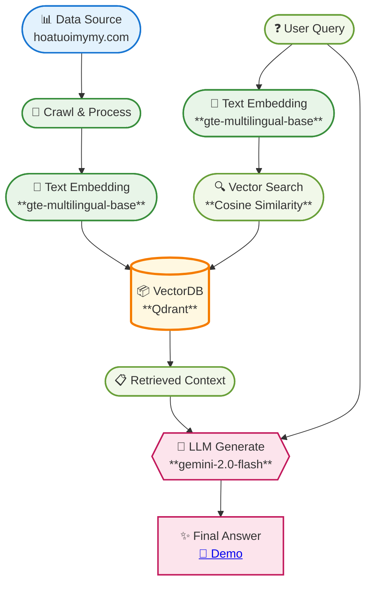

# RAG_Project
# 🚀 [🌐 Demo Project – Try it Live](https://vuhuy-rag.streamlit.app/)

```mermaid
graph TD
    A([📊 Data Source<br/>hoatuoimymy.com]) --> B([🔄 Crawl & Process])
    B --> C([🧮 Text Embedding <br/> **gte-multilingual-base**])
    C --> D[(📦 VectorDB <br/> **Qdrant**)]
    
    E([❓ User Query]) --> J([🧮 Text Embedding <br/> **gte-multilingual-base**])
    J --> F([🔍 Vector Search <br/> **Cosine Similarity**])
    F --> D
    D --> G([📋 Retrieved Context])
    
    E --> H{{🤖 LLM Generate <br/>**gemini-2.0-flash**}}
    G --> H
    H --> I[✨ Final Answer<br/><a href="https://vuhuy-rag.streamlit.app/" target="_blank">🔗 Demo</a>]

    %% Styling
    classDef source fill:#e3f2fd,stroke:#1976d2,stroke-width:2px
    classDef process fill:#e8f5e8,stroke:#388e3c,stroke-width:2px
    classDef storage fill:#fff8e1,stroke:#f57c00,stroke-width:3px
    classDef query fill:#f1f8e9,stroke:#689f38,stroke-width:2px
    classDef llm fill:#fce4ec,stroke:#c2185b,stroke-width:2px

    class A source
    class B,C,J process
    class D storage
    class E,F,G query
    class H,I llm
```

