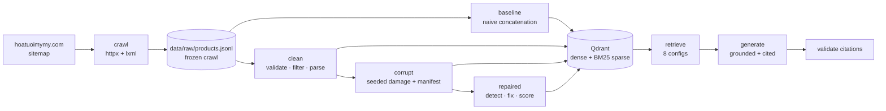

# RAG Chatbot for Vietnamese E-commerce Product Q&A

A retrieval-augmented chatbot over a 483-product Vietnamese florist catalogue —
built to be **measured**, not just demonstrated.

**[🌐 Live demo](https://vuhuy-rag.streamlit.app/)** · [Evaluation methodology](eval/README.md) · [Engineering decisions](docs/decisions.md)

> **Every number in this README is generated from a committed JSON file under
> `eval/results/` by `uv run python -m eval.compare`.** None is typed by hand,
> and `tests/test_readme_numbers.py` fails if any figure drifts from its source.

---

## The problem

Product catalogues are a hostile corpus for naive RAG. Marketing copy is written
to sound the same across an entire store, so the obvious ingestion approach —
concatenate every field and embed the result — encodes mostly text that every
document shares.

This catalogue is a clean example. Its promotional text is byte-identical across
products and its descriptions are near-identical boilerplate. Measured against a
naive concatenation baseline:

- **56% of documents** are built substantially from passages that recur verbatim
  across the corpus
- **52 of 484 documents (10.7%)** embed as the literal string `"nan"`, because a
  null in any field poisons the whole concatenation and stringifying it later
  produces that token
- the shop archive page is indexed as though it were a product
- price is stored as a formatted string (`"1.950.000₫"`), which makes budget
  filtering structurally impossible

None of this is visible from the demo. It is visible from measurement.

## Approach



Four corpus states built from **one frozen crawl**, so every comparison holds
the raw data constant and varies only the pipeline.

---

## Results

### Corpus quality by state

| Metric | baseline | clean | corrupt | repaired |
|---|---|---|---|---|
| Documents | 484 | 483 | 512 | 470 |
| Boilerplate tokens (doc-freq ≥60%) | 49.6% | 20.9% | 17.1% | 16.2% |
| **Docs built from repeated passages** | **56.0%** | **0.0%** | 19.7% | 1.3% |
| **Documents embedding to junk** | **52** | **0** | 0 | 0 |
| Literal `nan` tokens | 52 | 0 | 0 | 0 |
| Non-product URLs indexed | 1 | 0 | 22 | 0 |
| Price parse rate | 100.0% | 100.0% | 87.3% | 88.1% |

### Defect detection against ground truth

`corrupt` applies seeded, deliberate damage to the validated clean records and
emits a **manifest recording exactly which document received which defect**.
The repair detectors never see that manifest — they work from the records alone,
as they would against a corpus of unknown quality. It is used only to score them
afterwards.

| Defect | Precision | Recall | F1 |
|---|---|---|---|
| `non_product_page` | 1.000 | 1.000 | **1.000** |
| `duplication` | 0.960 | 1.000 | **0.980** |
| `truncation` | 0.951 | 1.000 | **0.975** |
| `mojibake` | 0.906 | 1.000 | **0.951** |
| `price_corruption` | 0.739 | 1.000 | **0.850** |
| `boilerplate_flood` | 0.928 | 0.744 | **0.826** |
| `missing_field` | 0.750 | 0.846 | **0.795** |
| **any defect** | 0.996 | 0.949 | **0.972** |

Macro F1 **0.911**. Downstream, repair recovers **80.0%** of the Recall@5 lost to
corruption (0.296 → 0.463, clean baseline 0.504).

**This design earned its keep.** Scoring detectors against a manifest exposed
four bugs that were invisible without ground truth — `missing_field` at 0.000
because the schema sanitised the corruption away on reload, `boilerplate_flood`
at 0.017 recall because a 60%-document-frequency threshold cannot see damage
confined to a minority of documents, plus two attribution errors. Macro F1 went
0.530 → **0.911** after fixing them.

### Retrieval A/B ladder

Each rung adds exactly one mechanism, so a delta is attributable.

| Config | Recall@5 | MRR@5 | nDCG@5 | Abstention F1 | p95 |
|---|---|---|---|---|---|
| `baseline` (naive control) | 0.504 | 0.683 | 0.671 | 0.000 | 492 ms |
| `dense` | 0.504 | 0.683 | 0.671 | 0.000 | 1 626 ms |
| `dense_threshold` | 0.504 | 0.683 | 0.671 | 0.250 | 276 ms |
| **`dense_budget`** | **0.654** | **0.917** | **0.878** | 0.091 | **471 ms** |
| `hybrid` (BM25 + RRF) | 0.417 | 0.694 | 0.545 | 0.000 | 521 ms |
| `hybrid_budget` | 0.567 | 0.903 | 0.732 | 0.091 | 468 ms |
| `dense_rerank` | 0.405 | 0.646 | 0.614 | 0.250 | 7 731 ms |
| `full` | 0.493 | 0.750 | 0.708 | **0.320** | 6 095 ms |

Parsing price into an integer payload index and filtering on it is worth
**+0.150 Recall@5** — and it is impossible while price remains a formatted
string. Abstention F1 moves 0.000 → 0.320 as the threshold and filter are added;
the 0.000 baseline is literal, since a system without a threshold never declines
to answer anything.

---

## Negative results

Kept deliberately. A repository that reports only what worked is not evidence of
measurement.

**Cosine score spread is not a quality metric.** When all five results are
correct, flat scores are a *success*. Measured directly, the clean corpus scores
slightly *worse* on spread than the baseline. It appears nowhere in the claims
above. ([D7](docs/decisions.md))

**The validated pipeline does not currently beat the naive baseline on
retrieval.** `dense` scores Recall@5 0.504 on clean vs 0.514 on baseline. At
n=12 this is noise, but it is not a result to hide: the corpus-health numbers
are solid, the retrieval improvement is **unproven**.
([D9](docs/decisions.md))

**BM25 hybrid hurts** — −0.087 Recall@5 in both pairings. fastembed has no
Vietnamese analyser (`language="vietnamese"` raises), so BM25 runs an English
stemmer over Vietnamese text. Adding the `dense_budget` control cell is what
revealed this: without it, `hybrid_budget` looked like the winner and the gain
would have been credited to hybrid rather than the filter.
([D10](docs/decisions.md))

**Cross-encoder reranking costs ~10× p95 latency and lowers Recall@5.**
([D10](docs/decisions.md))

**Tuning was stopped deliberately.** One embed-text variant was tried; its
metrics moved in opposite directions. Continuing to search for a variant that
reverses an unwelcome result would be selecting a configuration by overfitting
the evaluation set — the exact failure this project exists to guard against.

---

## Evaluation methodology

Full detail in **[eval/README.md](eval/README.md)**. In brief:

- **Queries come from real search behaviour.** No production traffic or support
  logs exist for a publicly crawled third-party catalogue, and none is invented.
  897 real queries were mined from search-engine autocomplete, producing query
  types nobody would have thought to write: budget phrasings
  (`hoa khai trương 500k`), out-of-area requests (`hoa chia buồn đà nẵng` — the
  shop serves HCMC only), and genuinely off-topic queries (`hoa tặng mẹ lớp 4`,
  a school essay assignment). The last two make the unanswerable slice realistic.
- **Intent and facets are derived deterministically**, covered by regression
  tests, because the free tier allows 20 LLM requests/day/model.
- **Gold labels come from pooled retrieval** across every corpus state, so they
  are not biased toward whichever system produced them, with deterministic
  budget and title-leakage backstops.
- **The judge is a different model from the generator**, so the system under
  test does not grade its own output.

### ⚠️ Current limitations

1. **n = 12 answerable queries.** Labelling stopped mid-run when the daily LLM
   quota ran out. One query changing outcome moves Recall@5 by ~0.08.
   **Every retrieval number above is provisional.** The corpus-quality and
   repair-detection figures are not affected — they are computed over the full
   corpus and against a complete manifest.
2. **No human review pass yet** — all golden rows are `reviewed=false`.
3. **RAGAS has not been run.** Faithfulness / Answer Relevancy / Context
   Recall / Context Precision need ~1000–1500 calls against a 20/day quota.
4. One shop, one language, one domain.

---

## Application features

- **Grounded answers with inline citations.** Every claim about price or product
  carries a `[n]` marker tied to a numbered source card.
- **Post-hoc citation validation.** Markers are parsed back out and checked
  against the supplied context. Fabricated indices are struck through rather
  than rendered as if real. Reported as three separate rates by confidence —
  `invalid_index_rate` is purely structural; the attribute-level check is a
  heuristic and is labelled as one.
- **Abstention.** Below the relevance threshold the system says so instead of
  recommending something irrelevant.
- **Conversation memory via query condensation.** "Cái nào rẻ hơn?" is rewritten
  into a standalone query *before* retrieval; embedding the whole transcript
  would dilute the query vector. A heuristic gate means self-contained questions
  cost zero LLM calls.
- **Budget filtering** on a parsed integer price index — `dưới 500k`, `tầm 1 triệu`.
- **Inspection panel** showing how the question was interpreted, which filters
  applied, and whether every statement is sourced.

The demo serves one configuration (`dense_budget` on the clean corpus) with no
knobs. Retrieval strategies and corpus states are evaluation apparatus, not
product features — an end user cannot meaningfully choose between
`hybrid_budget` and `dense_rerank`, and `corrupt` is a deliberately damaged
index that must never serve a real answer. They are reachable at
[`?lab=1`](https://vuhuy-rag.streamlit.app/?lab=1), which also exposes retrieval
scores and the per-stage latency breakdown.

---

## Running it

```bash
git clone https://github.com/vuhuyng04/RAG_Project && cd RAG_Project
uv sync                                   # bit-identical env from uv.lock
cp .env.example .env                      # add GEMINI_API_KEY, QDRANT_*

uv run python -m scripts.build_state --state clean
uv run python -m scripts.build_state --state baseline
uv run python -m scripts.build_state --state corrupt --seed 42
uv run python -m scripts.build_state --state repaired

uv run python -m eval.run_retrieval       # deterministic metrics, no LLM calls
uv run python -m eval.compare             # regenerate every table above

uv run pytest                             # 109 tests
uv run streamlit run chatbot.py
```

Reproducibility checks:

```bash
uv sync --locked                          # fails if pyproject drifts from uv.lock
uv run python -m scripts.build_state --state corrupt --seed 42   # identical manifest
```

## Stack

`gte-multilingual-base` embeddings (768-d, cosine) · Qdrant with dense + BM25
sparse vectors and payload indexes · `gemini-2.5-flash` generation,
`gemini-3.6-flash` judging · Streamlit · `uv` + committed lockfile · pytest ·
ruff

Two version constraints worth knowing, both found by hitting them: `transformers`
is pinned `<5` (on 5.15 the gte models load fine and then crash at inference with
a garbage-index `IndexError` inside their custom attention), and the Gemini model
is pinned rather than aliased, because an alias silently changes the model
underneath committed evaluation numbers.
